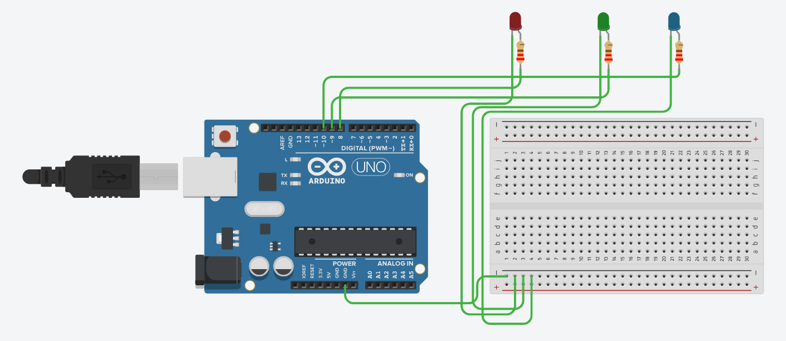
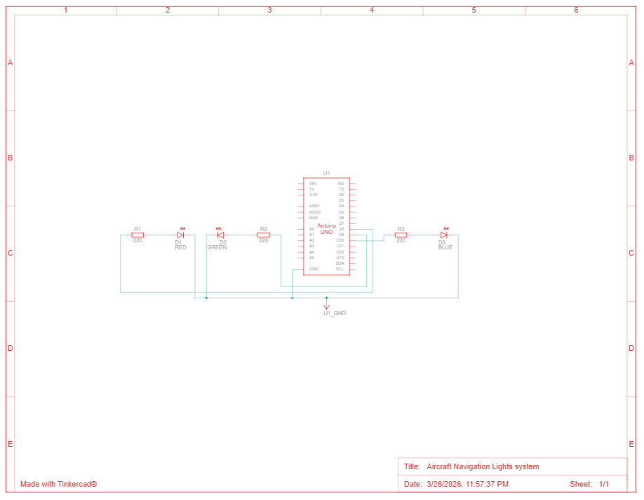

# Aircraft Navigation Lights System

## What it does
Simulates an Aircraft Navigation Lights system using an Arduino Uno and three LEDs. The red (left wing) and green (right wing) LEDs blink at 1Hz in opposite phases — when one is ON, the other is OFF — while the blue tail light remains continuously ON. This mimics the real world FAA standard for aircraft navigation lighting.

## Components
- 1 Arduino Uno R3
- 1 Red LED
- 1 Green LED
- 1 Blue LED
- 3 220Ω Resistors

## Circuit

## How it works
The system uses Arduino's millis() function for non-blocking timing (instead of delay()), it tracks elapsed time and toggles the red and green LEDs every 500ms, creating a 1Hz alternating blink without freezing the microcontroller. A single boolean flag ledState drives both LEDs simultaneously: red follows the flag directly while green takes its inverse, ensuring they're always in opposite phases.

Each LED is connected to a digital output pin (8, 9, 10) on the Arduino through a 220Ω current-limiting resistor on a breadboard, which protects the LEDs from excess current. The blue tail LED is set to HIGH once in setup() and never touched again in the loop, keeping it permanently on. Serial output logs the state of all three lights every half second, which is useful for debugging via the Serial Monitor.

## Code
See [aircraft_navigation_lights_system.ino](./aircraft_navigation_lights_system.ino)

## TinkerCAD Link
[Open simulation](https://www.tinkercad.com/things/abHLJodHew9-aircraft-navigation-lights-system?sharecode=K9p7MAIkbyCdWe2Z8ADiVxX5SOmqq_7MWUqXdp86W-k)
