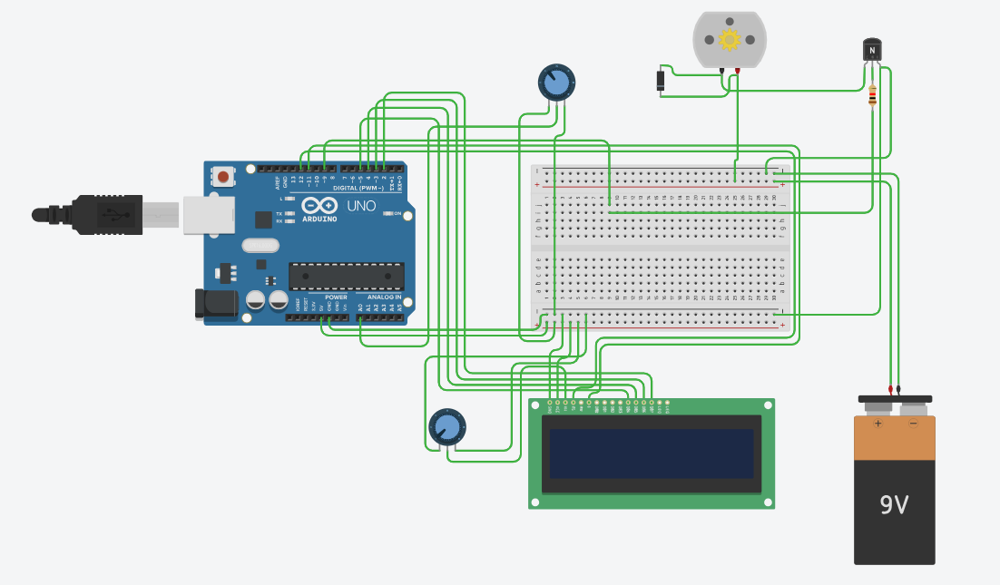
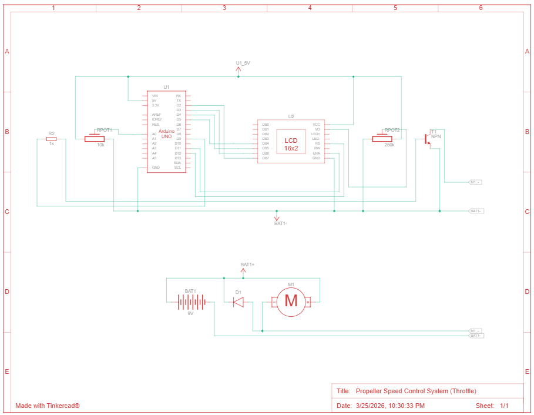

# Propeller Speed Control System

## What it does
Controls motor speed using PWM signals through a potentiometer input.

## Components
- 1 Arduino Uno R3
- 1 DC Motor
- 1 10kΩ Potentiometer
- 1 250kΩ Potentiometer
- 1 kΩ Resistor
- 1 Diode
- 1 LCD 16x2
- 1 NPN Transistor
- 1 9V Battery

## Circuit

## How it works
This project simulates a propeller speed control (throttle system) in Tinkercad using an Arduino IDE-compatible Arduino Uno, where a potentiometer acts as throttle input to vary DC motor speed through PWM control.

The potentiometer’s analog input is mapped to a PWM output that drives the motor via a transistor, enabling smooth electronic speed control similar to drone throttle behavior.

A 16x2 LCD continuously displays the real-time throttle percentage (0–100%), providing user feedback during simulation.
This setup demonstrates the basics of motor control, PWM signal generation, analog input reading, and embedded display interfacing in a compact prototype.

## Code
See [propeller_speed_control.ino](./propeller_speed_control.ino)

## TinkerCAD Link
[Open simulation](https://www.tinkercad.com/things/bdu591nq0Qg-propeller-speed-control-system-throttle?sharecode=_uOGCQNFGrMt2BDuPAJd4NTT79dWJKf3bbfkZsstf04)
